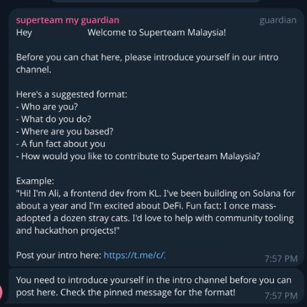
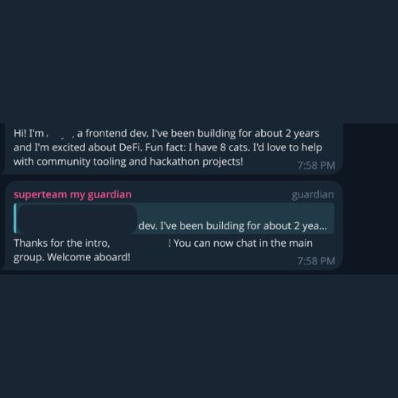

# Superteammy Guardian

Telegram onboarding bot for Superteam Malaysia. New members must introduce themselves in a dedicated intro channel before they can chat in the main group.

## How It Works

1. **User joins the main group** — bot sends a welcome message with intro format and a link to the intro channel
2. **User posts in the intro channel** — bot validates the intro and marks them as introduced
3. **User posts in the main group** — if not introduced, message is deleted and a temporary reminder is sent
4. **Group admins** can manually approve, reset, or check user status via commands
5. **Any message containing a suspicious link** (URL shorteners, bare IP addresses, IDN homograph domains, or Telegram invite links) in the main group is **deleted** and the sender receives a warning — admins are exempt

## Screenshots

<table>
  <tr>
    <td align="center" width="50%">
      <br/>
      <sub><b>Welcome message</b> sent when a new member joins, and the <b>gatekeeper reminder</b> when they try to post before introducing themselves</sub>
    </td>
    <td align="center" width="50%">
      <br/>
      <sub>Member posts a valid intro and the bot <b>accepts it</b> — they can now chat freely in the main group</sub>
    </td>
  </tr>
</table>

## Quick Start

### 1. Create a Bot

Message [@BotFather](https://t.me/BotFather) on Telegram, send `/newbot`, and copy the token.

### 2. Install and Configure

```bash
cp .env.example .env
```

Add your bot token to `.env`:

```
BOT_TOKEN=your-bot-token
```

That's the only config needed. The bot uses Telegram's group admin roles automatically.

### 3. Run

```bash
npm install
npm run dev
```

Or with Docker:

```bash
docker compose up -d
```

### Running Tests

```bash
npm test                 # run all tests
npm run test:watch       # watch mode
npm run test:coverage    # with coverage report
```

### 4. Register Your Chats

1. Add the bot as **admin** to your main group (needs "Delete Messages" permission)
2. Add the bot to your intro channel (needs "Post Messages" permission)
3. Send `/setgroup` in the **main group**
4. Send `/setintro` in the **intro channel**

Done. The bot saves these settings to the database — you only need to do this once.

## Admin Commands

Any **Telegram group admin** can use these commands — no separate config needed.

### Setup (run once, in each chat)

| Command | Description |
|---|---|
| `/setgroup` | Register the current chat as the main group |
| `/setintro` | Register the current chat as the intro channel |

### Management (main group only)

| Command | Description |
|---|---|
| `/approve <user_id or @username>` | Manually mark a user as introduced |
| `/reset <user_id or @username>` | Reset intro status (forces re-introduction) |
| `/status <user_id or @username>` | Check a user's current status |
| `/pending` | List all users who haven't introduced yet |

All management commands support a user ID, an `@username`, or replying to a message.

## Intro Validation

The bot uses a soft heuristic — not a strict template:

- Message must be at least **50 characters**
- Accepted if it contains **2+ keywords** (who are you, what do you do, where are you based, fun fact, contribute)
- Messages **80+ characters** are accepted regardless of keywords
- Messages over **4000 characters** are rejected

Prefers false positives over false negatives — a borderline intro is better than blocking a real member.

## Project Structure

```
src/
  bot.js                 # Entry point — wiring and launch
  config.js              # Constants, message templates, chat ID state
  db.js                  # SQLite data access layer (better-sqlite3)
  adminCache.js          # In-memory cache for Telegram admin lookups
  CooldownMap.js         # Reusable rate-limiter / cooldown utility
  handlers/
    welcome.js           # New member join handler
    intro.js             # Intro channel message listener
    gatekeeper.js        # Main group message filter
    admin.js             # Admin commands
    security.js          # Suspicious link scanner (URL shorteners and bare IP addresses)
tests/
  CooldownMap.test.js    # Rate-limiter unit tests
  config.test.js         # Config and sanitization unit tests
  db.test.js             # Database layer unit tests
  adminCache.test.js     # Admin cache unit tests
  integration.test.js    # Cross-handler user flow integration tests
  handlers/
    welcome.test.js
    intro.test.js
    gatekeeper.test.js
    admin.test.js
    security.test.js
```

## Environment Variables

| Variable | Required | Description |
|---|---|---|
| `BOT_TOKEN` | Yes | Telegram bot token from @BotFather |
| `MAIN_GROUP_ID` | No | Main group chat ID (or use `/setgroup`) |
| `INTRO_CHANNEL_ID` | No | Intro channel chat ID (or use `/setintro`) |
| `DB_PATH` | No | SQLite file path (default: `./data/bot.sqlite`) |

See [GUIDE.md](GUIDE.md) for detailed usage instructions covering every user flow.
